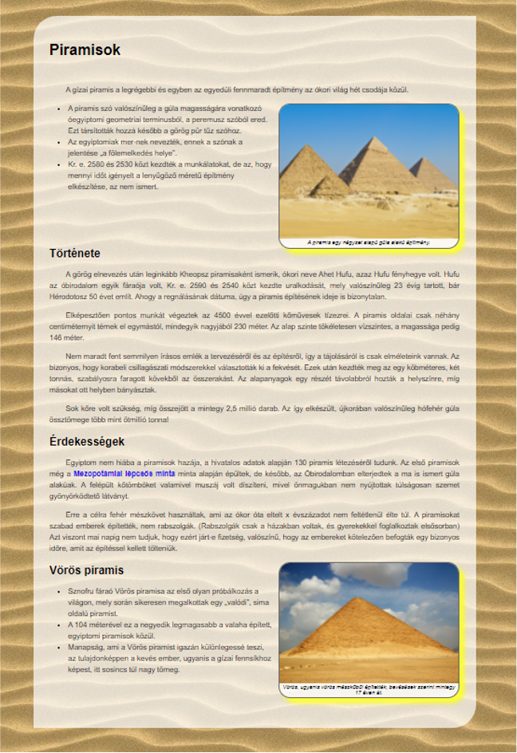

# Weblapszerkesztés

Ebben a feladatban egy ókori csodákat bemutató weboldalt kell felépítened a megadott forrásfájlok és a minta alapján. 

**Időkeret:** Erre a feladatra a vizsgán körülbelül 60 perced lesz.

## Forrásfájlok letöltése
Mielőtt elkezded, töltsd le és csomagold ki a feladathoz tartozó nyersanyagokat egy üres mappába!
👉 **[Forrásfájlok letöltése (piramisok_forras.zip)](../files/piramisok/piramisok_forrasok.zip)** 

---

## Megoldás lépésről lépésre

### 1-3. feladat: Alapbeállítások
> **Feladat:** Hozzon létre HTML oldalt `piramis.html` néven! Állítsa be az oldal nyelvét magyarra és a kódolását UTF-8-ra! A böngésző címsorában megjelenő cím „Piramisok” legyen! A fejrészben helyezzen el hivatkozást a `piramis.css` stíluslapra!

??? success "Megoldás mutatása"
    **Megoldás:**
    Először létrehozzuk a szabványos HTML5 vázat. A `<html lang="hu">` felel a magyar nyelvért, a `<meta charset="UTF-8">` a kódolásért. A `<title>` adja meg a böngészőfül nevét, a `<link>` taggel pedig rákötjük a megadott CSS fájlt.

    ```html
    <!DOCTYPE html>
    <html lang="hu">
    <head>
        <meta charset="UTF-8">
        <title>Piramisok</title>
        <link rel="stylesheet" href="piramis.css">
    </head>
    <body>
        <!-- Ide jön majd az oldal tartalma -->
    </body>
    </html>
    ```

---

### 4. feladat: A fő tárolódoboz (DIV)
> **Feladat:** Az oldal törzsébe helyezzen el egy DIV keretet, amit formázzon a stíluslap `leiras` azonosítójának felhasználásával! A keretbe másolja be az UTF-8 kódolású `forras.txt` állomány tartalmát!

??? success "Megoldás mutatása"
    **Megoldás:**
    A feladat *azonosítót* kér, ami a HTML-ben mindig az `id` attribútumot jelenti! Hozunk egy `<div id="leiras">` dobozt a `<body>` elemek közé, és belemásoljuk a nyers szöveget. Innentől minden ezen a dobozon *belül* fog történni!

    ```html
    <body>
        <div id="leiras">
            Piramisok
            A gizai piramis a legrégebbi és egyben az egyedüli fennmaradt...
            (ide jön a teljes nyers szöveg)
        </div>
    </body>
    ```

---

### 5-6. feladat: Címsorok és bekezdések
> **Feladat:** Alakítsa ki a címeket a minta szerint! A weboldal címe („Piramisok”) 1-es szintű címsor legyen! Az alcímek („Története”, „Érdekességek”, és „Vörös piramis”) 2-es szintű címsor legyenek! Alakítsa ki a szöveg bekezdéseit a minta szerint!

??? success "Megoldás mutatása"
    **Megoldás:**
    Az 1-es szintű címsor a `<h1>`, a 2-es szintűek a `<h2>` tagek lesznek. A folyószövegeket sima bekezdés, azaz `<p>` tagek közé kell zárni.

    ```html
            <h1>Piramisok</h1>
            
            <p>A gizai piramis a legrégebbi és egyben az egyedüli fennmaradt építmény az ókori világ hét csodája közül.</p>
            
            <!-- Itt lesz az első felsorolás (későbbi feladat) -->

            <h2>Története</h2>
            
            <p>A görög elnevezés után leginkább Kheopsz piramisaként ismerik, ókori neve Ahet Hufu...</p>
            <p>Elképesztően pontos munkát végeztek az 4500 évvel ezelőtti...</p>
    ```

---

### 7. feladat: Az első kép és a képkeret
> **Feladat:** Az első bekezdés után helyezzen el egy keret (DIV) elemet, és formázza a stíluslap `kepkeret` osztálykijelölőjének felhasználásával! Illessze be a `piramis.jpg` képet. Ha a kép fölé visszük az egeret, vagy nem jeleníthető meg, a „Gizai piramis” szöveg jelenjen meg! A { } jelek közt lévő kísérő szöveget helyezze a kép után, a { } jeleket törölje!

??? success "Megoldás mutatása"
    **Megoldás:**
    A "Gizai piramis" szöveget két helyre is be kell tennünk a képbe: az `alt` (ha nem tölt be) és a `title` (ha rávisszük az egeret) attribútumokba! Az *osztálykijelölő* azt jelenti, hogy most nem id-t, hanem `class`-t használunk.

    ```html
            <p>A gizai piramis a legrégebbi és egyben az egyedüli fennmaradt építmény az ókori világ hét csodája közül.</p>

            <div class="kepkeret">
                
                <p>A piramis egy négyzet alapú gúla alakú építmény.</p>
            </div>
    ```

---

### 8. feladat: A második kép
> **Feladat:** Az utolsó címsor elé helyezzen el egy újabb keret (DIV) elemet a `kepkeret` osztállyal! Illessze be a `voros.jpg` képet a „Vörös piramis” helyettesítő szövegekkel. A { } jelek közt lévő képkísérő szöveget helyezze el a kép után, a { } jeleket törölje!

??? success "Megoldás mutatása"
    **Megoldás:**
    A logika pontosan ugyanaz, mint az előzőnél, csak nagyon kell figyelni a pozícióra: a keretet Még a `<h2>Vörös piramis</h2>` **ELÉ** kell beszúrni a kódba!

    ```html
            <div class="kepkeret">
                
                <p>Vörös, ugyanis vörös mészkőből építették, becslések szerint mintegy 17 éven át.</p>
            </div>

            <h2>Vörös piramis</h2>
    ```

---

### 9. feladat: Hiperhivatkozás (Link)
> **Feladat:** Keresse meg a ”mezopotámiai lépcsős minta” kifejezést és alakítsa át új ablakban megnyíló hivatkozássá. Az URL a [ ] jelek között található. A [ ] jeleket törölje!

??? success "Megoldás mutatása"
    **Megoldás:**
    A linkeléshez az `<a>` taget használjuk, aminek adunk egy `href` (célpont) attribútumot. Az új ablakos megnyitást a `target="_blank"` biztosítja.

    ```html
            <!-- Részlet az Érdekességek bekezdésből: -->
            <p>Egyiptom nem hiába a piramisok hazája, a hivatalos adatok alapján 130 piramis létezéséről tudunk. Az első piramisok még a <a href="http://hu.wikipedia.org/wiki/Piramis" target="_blank">mezopotámiai lépcsős minta</a> minta alapján épültek...</p>
    ```

---

### 10. feladat: Listák (Felsorolások)
> **Feladat:** Alakítsa ki a felsorolásokat! A felsorolás elemei a + jellel kezdődő bekezdések. A + jelölőkaraktereket törölje!

??? success "Megoldás mutatása"
    **Megoldás:**
    A számozatlan (pöttyös) listát az `<ul>` tag fogja közre. Ezen belül minden egyes sort egy-egy `<li>` tagbe kell csomagolni. A nyers + jeleket pedig mindenhonnan ki kell törölni.

    ```html
            <ul>
                <li>A piramis szó valószínűleg a gúla magasságára vonatkozó...</li>
                <li>Az egyiptomiak mer-nek nevezték, ennek a szónak a...</li>
                <li>Kr. e. 2580 és 2530 közt kezdték a munkálatokat, de az...</li>
            </ul>
    ```

---

### 11. feladat: CSS Formázások (`piramis.css`)
> **Feladat:** A következő beállításokat a stíluslap megfelelő kijelölőinél végezze el!
> a) `hatter.jpg` a weboldal háttereként.
> b) A `leiras` azonosítójú elem belső margója 35 képpont.
> c) Az egyes szintű címsor stílusának kiterjesztése a kettes szintűre.
> d) A `kepkeret` osztály: 2 képpont vastag, dimgray, folytonos szegély és dőlt betű.
> e) A hivatkozások szövege félkövér.

??? success "Megoldás mutatása"
    **Megoldás:**
    A vizsgán kapsz egy előre elkészített `piramis.css` fájlt, amiben már benne vannak az alapvető formázások. Neked csak meg kell találnod a megfelelő kijelölőket (szelektorokat), és **bővítened kell** azokat az új szabályokkal!

    Íme a teljes, végleges CSS kód. Kommentekkel (`/* ... */`) jelöltük, hogy mit és hova kellett beszúrni:

    ```css
    body {
        font-family: sans-serif;
        /* 11. a) Háttérkép beállítása a teljes weblapra */
        background-image: url('hatter.jpg'); 
    }

    #leiras {
        background-image: url('keret.png');
        width: 880px;
        margin: auto;
        margin-top: 50px;
        margin-bottom: 50px;
        border-top-left-radius: 50px;
        border-bottom-right-radius: 50px;
        /* 11. b) Belső margó hozzáadása */
        padding: 35px; 
    }

    /* 11. c) A stílus kiterjesztése: a h1 mellé vesszővel beírtuk a h2-t is! */
    h1, h2 {
        color: grey;
        font-variant: small-caps;
        text-shadow: 1px 1px rgb(195, 180, 180);
    }

    p {
        text-indent: 35px;
        text-align: justify;
        letter-spacing: -0.1px;
        line-height: 150%;
    }

    .kepkeret {
        width: 375px;
        float: right;
        text-align: center;
        font-size: 75%;
        padding: 0px 5px 5px;
        margin-left: 10px;
        background-image: url('keret.png');
        border-radius: 25px;
        overflow: hidden;
        box-shadow: 10px 10px 10px yellow;
        /* 11. d) Szegély és dőlt betű hozzáadása */
        border: 2px solid dimgray;
        font-style: italic; 
    }

    .kepkeret img {
        width: 385px;
        position: relative;
        left: -5px;
    }

    a {
        text-decoration: none;
        /* 11. e) Hivatkozások félkövérré tétele */
        font-weight: bold; 
    }

    ul {
        line-height: 1.5;
        margin-bottom: 25px; 
    }
    ```

## Minta megoldás




