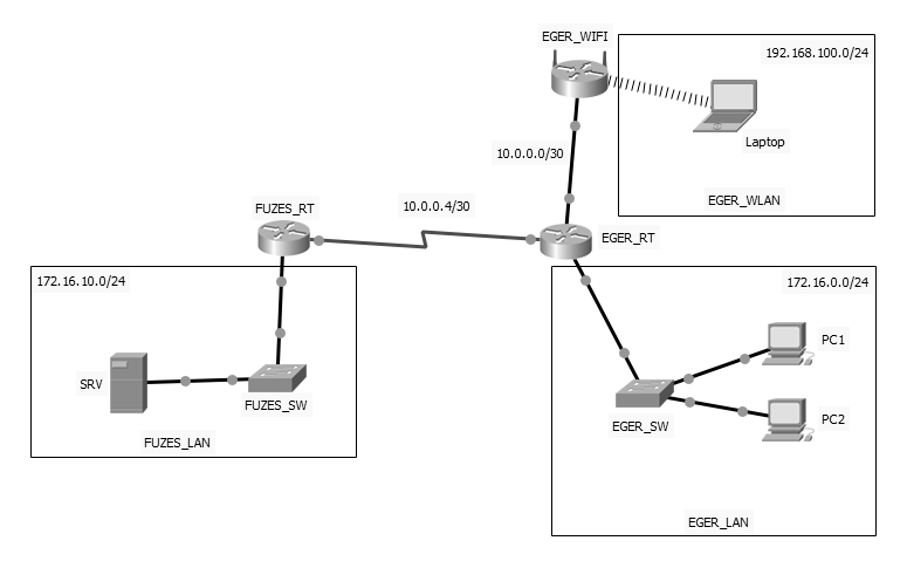

# Hálózatépítés

A vizsga ezen moduljában egy szimulációs szoftver (Cisco Packet Tracer) segítségével kell egy hálózati topológiát felépítened, majd az eszközökön elvégezned az IP-címzést és a konfigurációs feladatokat. 

**Időkeret:** Erre a feladatra a vizsgán nagyságrendileg 60 perced lesz.

---

## A hálózat topológiai terve



---

## Hálózati címzés

| Eszköz | IP cím | Alhálózati maszk | Alapértelmezett átjáró |
| :--- | :--- | :--- | :--- |
| **FUZES_RT** | 10.0.0.5<br>172.16.10.254 | 255.255.255.252<br>255.255.255.0 | -<br>- |
| **EGER_RT** | 10.0.0.6<br>10.0.0.1<br>172.16.0.254 | 255.255.255.252<br>255.255.255.252<br>255.255.255.0 | -<br>-<br>- |
| **EGER_WIFI** | 10.0.0.2<br>192.168.100.254 | 255.255.255.252<br>255.255.255.0 | 10.0.0.1<br>- |
| **EGER_SW** | 172.16.0.253 | 255.255.255.0 | 172.16.0.254 |
| **SRV** | 172.16.10.1 | 255.255.255.0 | 172.16.10.254 |
| **PC1** | 172.16.0.1 | 255.255.255.0 | 172.16.0.254 |
| **PC2** | 172.16.0.2 | 255.255.255.0 | 172.16.0.254 |
| **Laptop** | - | DHCP kliens | - |

---

## Megoldás lépésről lépésre

### 1-2. feladat: Topológia és állomásnevek
> **Feladat:** Szimulációs programban válassza ki a szükséges eszközöket és kösse őket össze a topológiai ábrának megfelelően. A Vezeték nélküli hálózatot egy SOHO forgalomirányító biztosítsa. A SOHO routert az Internet interfészén csatlakoztassa az EGER_RT forgalomirányítóhoz. Állítsa be a kapcsolók és forgalomirányítók állomásneveit a topológiai ábrának megfelelően! (kivéve a vezeték nélküli forgalomirányítót)

??? success "Megoldás mutatása"
    **Megoldás menete:**
    
    1. A munkaterületre húzz be 2 db routert (pl. 4321 vagy 1941), 2 db switchet (pl. 2960), 1 db SOHO vezeték nélküli routert (WRT300N), 1 db szervert, 2 db PC-t és 1 db laptopot.
    
    2. A fizikai kapcsolatokat a topológiai ábra alapján kösd be. A végberendezéseket (PC-k, Szerver) egyenes kötésű (Straight-through) kábellel kösd a switchekhez, és a switcheket is a routerek Gigabites portjához. A SOHO router Internet portját egyenes kábellel csatlakoztasd az `EGER_RT` egyik szabad portjához. A két Cisco router (`FUZES_RT` és `EGER_RT`) közötti piros villám jelölés soros (Serial) WAN kapcsolatot jelent, ehhez a routerekbe Serial modult (pl. HWIC-2T) kell tenni kikapcsolt állapotban.
    
    3. Az állomásneveket a parancssorban (CLI) a `hostname` paranccsal adjuk meg.

    **CLI parancsok:**
    Minden Cisco eszközön (FUZES_RT, EGER_RT, FUZES_SW, EGER_SW) lépj be a konfigurációs módba:
    ```cisco
    enable
    configure terminal
    hostname FUZES_RT
    ```
    *(Értelemszerűen a `hostname` utáni nevet mindig az adott eszköz topológiai nevére kell cserélni.)*

---

### 3-6. feladat: IP-címzés és EGER_SW konfigurációja
> **Feladat:** Állítsa be a forgalomirányítók IP címeit a címzési táblázatnak, illetve az ábrának megfelelően! Állítsa be az EGER_SW kapcsolót a táblázat alapján. Konfiguráljon távoli, telnet kapcsolati elérést az EGER_SW kapcsolón. A belépéshez szükséges jelszó: **rezsi** legyen. Az EGER_SW kapcsolón állítsa be a privilegizált módot védő jelszót: **class**.

??? success "Megoldás mutatása"
    **Megoldás menete:**
    
    1. A forgalomirányítókon interfészenként (`interface [portnév]`) megadjuk az IP-címet és az alhálózati maszkot, majd a `no shutdown` paranccsal bekapcsoljuk a portokat.
    
    2. A kapcsoló (EGER_SW) IP-címét a virtuális kezelő interfészen (`interface vlan 1`) kell megadni, valamint az alapértelmezett átjárót (`ip default-gateway`) is be kell állítani a globális konfigurációs módban.
    
    3. A Telnethez a VTY vonalakat (`line vty 0 4`), a privilegizált módhoz (enable) a titkosított jelszót (`enable secret`) állítjuk be.

    **FUZES_RT parancsok:**
    ```cisco
    interface g0/0
      ip address 172.16.10.254 255.255.255.0
      no shutdown
    interface s0/0/0
      ip address 10.0.0.5 255.255.255.252
      no shutdown
    ```
    *(Megjegyzés: A portok pontos neve - pl. g0/0 vagy g0/1 - attól függ, hova dugtad a kábelt a szimulátorban!)*

    **EGER_RT parancsok:**
    ```cisco
    interface g0/0
      ip address 172.16.0.254 255.255.255.0
      no shutdown
    interface g0/1
      ip address 10.0.0.1 255.255.255.252
      no shutdown
    interface s0/0/0
      ip address 10.0.0.6 255.255.255.252
      no shutdown
    ```

    **EGER_SW parancsok:**
    ```cisco
    ip default-gateway 172.16.0.254
    interface vlan 1
      ip address 172.16.0.253 255.255.255.0
      no shutdown
    exit
    
    enable secret class
    
    line vty 0 4
      password rezsi
      login
    ```

---

### 7-11. feladat: Végberendezések és Útválasztás (Routing)
> **Feladat:** Állítsa be az SRV, a PC1 és PC2 számítógépek IP címeit, a táblázat alapján. A DNS szerver címe **8.8.8.8** legyen. Konfigurálja a FUZES_RT és EGER_RT forgalomirányítókat úgy, hogy az alapértelmezett útvonaluk egymás felé mutasson az ábrán megadott parancsok (`ip route 0.0.0.0 0.0.0.0 [következő ugrás IP]`) kiadásával.

??? success "Megoldás mutatása"
    **Végberendezések (Grafikus felületen):**
    Kattints az eszközökre (SRV, PC1, PC2), majd a **Desktop -> IP Configuration** menüben add meg a táblázat adatait:
    
    *   **SRV:** IP: `172.16.10.1`, Maszk: `255.255.255.0`, GW: `172.16.10.254`, DNS: `8.8.8.8`
    
    *   **PC1:** IP: `172.16.0.1`, Maszk: `255.255.255.0`, GW: `172.16.0.254`, DNS: `8.8.8.8`

    *   **PC2:** IP: `172.16.0.2`, Maszk: `255.255.255.0`, GW: `172.16.0.254`, DNS: `8.8.8.8`

    **Statikus útválasztás (Alapértelmezett útvonalak a routereken):**
    *(A globális konfigurációs módban kell kiadni!)*

    **FUZES_RT:**
    ```cisco
    ip route 0.0.0.0 0.0.0.0 10.0.0.6
    ```

    **EGER_RT:**
    ```cisco
    ip route 0.0.0.0 0.0.0.0 10.0.0.5
    ```

---

### 12-14. feladat: Vezeték nélküli hálózat beállítása
> **Feladat:** Az EGER_WIFI forgalomirányítón állítsa be a DHCP szolgáltatást az ábrának megfelelő hálózatra. A vezeték nélküli hálózat neve legyen **EGER_WIFI**. A kapcsolat biztonsága WPA2, a kapcsolódáshoz szükséges jelszó **abcd1234**. Csatlakoztassa a laptopot a hálózatra, és állítsa az IP konfigurációját a táblázat alapján.

??? success "Megoldás mutatása"
    Ezt teljes egészében az `EGER_WIFI` (WRT300N) eszköz grafikus (GUI) felületén kell elvégezni.

    1. **Setup -> Basic Setup fül:**
       *   **Internet Setup (WAN port):** Válaszd a Static IP-t, majd állítsd be az IP-t (`10.0.0.2`), Maszkot (`255.255.255.252`), és Átjárót (`10.0.0.1`).
       *   **Network Setup (LAN portok):** Az IP-cím legyen `192.168.100.254` (Maszk: `255.255.255.0`). A DHCP szervert állítsd **Enable** állapotra, hogy kioszthassa a címeket a hálózatban. 
       *   Görgess a lap aljára: **Save Settings**.
    2. **Wireless -> Basic Wireless Settings fül:**
       *   Network Name (SSID): írd be, hogy **EGER_WIFI**.
       *   **Save Settings**.
    3. **Wireless -> Wireless Security fül:**
       *   Security Mode: **WPA2 Personal**.
       *   Passphrase: **abcd1234**.
       *   **Save Settings**.
    4. **Laptop beállítása:**
       *   Lépj a Laptopra. Ha nincs benne WiFi modul, ki kell kapcsolni (Power gomb), ki kell cserélni a FastEthernet modult a WPC300N (vezeték nélküli) modulra, majd vissza kell kapcsolni a gépet.
       *   A **Desktop -> PC Wireless** alkalmazásban a *Connect* fülön válaszd ki az `EGER_WIFI` hálózatot, és add meg az `abcd1234` jelszót.
       *   Ellenőrizd az **IP Configuration** ablakban, hogy a **DHCP** van-e kiválasztva, és hogy a gép sikeresen kapott-e 192.168.100.X formátumú címet.

---

### 15. feladat: Konfigurációk mentése
> **Feladat:** Mentse el az EGER_SW, a FUZES_RT és az EGER_RT eszközök konfigurációját, hogy azok újraindítás után automatikusan betöltődjenek.

??? success "Megoldás mutatása"
    Lépj be mindhárom megadott eszközön (EGER_SW, FUZES_RT, EGER_RT) a CLI felületre, és a Privilegizált módba (`Router#` vagy `Switch#` szint, azaz lépj ki a `configure terminal` módból az `exit` paranccsal).
    Írd be a mentéshez szükséges parancsot:

    ```cisco
    copy running-config startup-config
    ```
    *(Nyomj egy entert a jóváhagyáshoz, amikor rákérdez a fájlnévre!)*